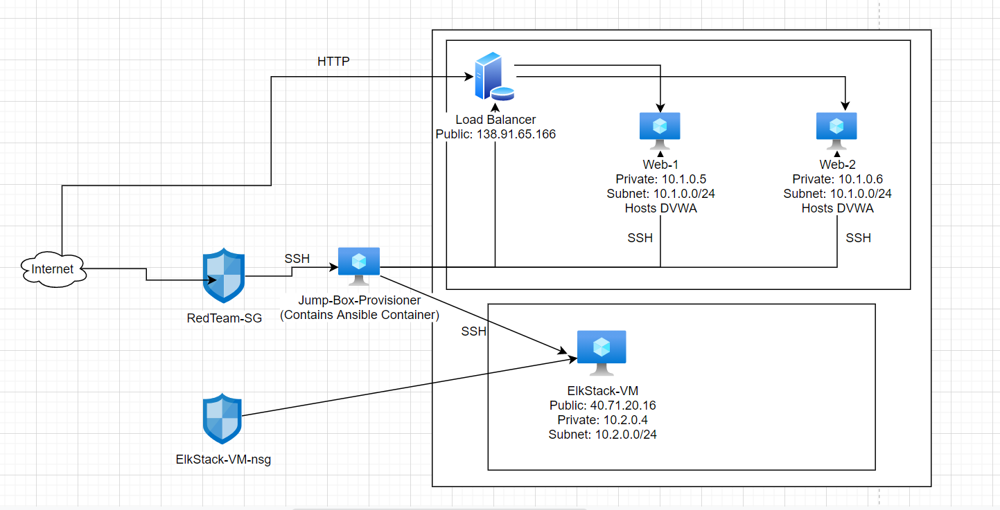
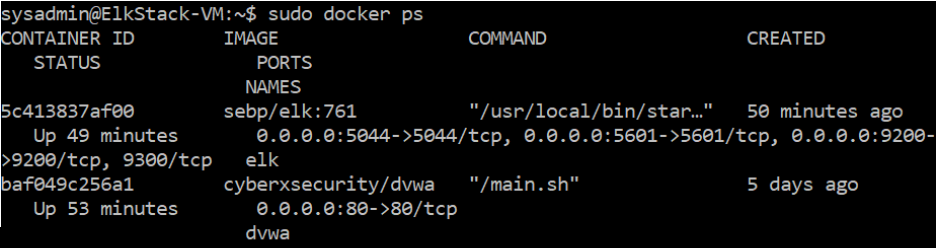

 ## Automated ELK Stack Deployment

The files in this repository were used to configure the network depicted below.

These files have been tested and used to generate a live ELK deployment on Azure. They can be used to either recreate the entire deployment pictured above. Alternatively, select portions of the _____ file may be used to install only certain pieces of it, such as Filebeat.

  - _TODO: Enter the playbook file._ 

This document contains the following details:
- Description of the Topology
- Access Policies
- ELK Configuration
  - Beats in Use
  - Machines Being Monitored
- How to Use the Ansible Build

### Description of the Topology

The main purpose of this network is to expose a load-balanced and monitored instance of DVWA, the D*mn Vulnerable Web Application.

Load balancing ensures that the application will be highly available, in addition to restricting overload to the network.
- What aspect of security do load balancers protect? What is the advantage of a jump box? The load balancers will protect the availability of a network by helping to stop a Ddos attack. An advantage of a jump box is that it is our outward facing part of the network and prevents all the other VM’s from the public.

Integrating an ELK server allows users to easily monitor the vulnerable VMs for changes to the logs and system traffic.
- What does Filebeat watch for? The log files or locations that you specify, collects log events, and forwards them either to Elasticsearch
- What does Metricbeat record? metrics and statistics

The configuration details of each machine may be found below.
_Note: Use the [Markdown Table Generator](http://www.tablesgenerator.com/markdown_tables) to add/remove values from the table_.

| Name     | Function | IP Address | Operating System |
|----------|----------|------------|------------------|
| Jump Box      | Gateway  | 10.0.0.1   | Linux |
| Web-1         | Web server | 10.1.0.5   | Linux     |
| Web-2         | Web Server | 10.1.0.6   | Linux     |
| ElkStack-VM   | SIEM       | 10.2.0.4   | Linux     |

### Access Policies

The machines on the internal network are not exposed to the public Internet.

Only the Jump Box machine can accept connections from the Internet. Access to this machine is only allowed from the following IP addresses:
- _TODO: Add whitelisted IP addresses_ The whitelisted IP address is going to be my home IP Adress.

Machines within the network can only be accessed by the Jumpbox.
- _TODO: Which machine did you allow to access your ELK VM? Jump Box What was its IP address?_ 10.0.0.1

A summary of the access policies in place can be found in the table below.

| Name     | Publicly Accessible | Allowed IP Addresses |
|----------|---------------------|----------------------|
| Jump Box | Yes                 | My IP Address|
| Web-1         | Yes            | 10.0.0.1              |
| Web-2         | Yes            | 10.0.0.1              |

### Elk Configuration

Ansible was used to automate configuration of the ELK machine. No configuration was performed manually, which is advantageous because...
- What is the main advantage of automating configuration with Ansible? You don't have to go in and start every server and connect everything. You can just automate it so it does it all for you so you have time for other things.

The playbook implements the following tasks:
- _TODO: In 3-5 bullets, explain the steps of the ELK installation play. E.g.,
- install Docker
- download image
- install python3-pip
- download and launch docker elk container
- list the ports that elk runs on

The following screenshot displays the result of running `docker ps` after successfully configuring the ELK instance.

### Target Machines & Beats
This ELK server is configured to monitor the following machines:
- 10.1.0.5, 10.1.0.6

We have installed the following Beats on these machines:
- _TODO: Specify which Beats you successfully installed_ Filebeat

These Beats allow us to collect the following information from each machine:
- _TODO: In 1-2 sentences, explain what kind of data each beat collects, and provide 1 example of what you expect to see. E.g., `Winlogbeat` collects Windows logs, which we use to track user logon events, etc._ File Beat will track our auth logs, and track SSH user logons.

### Using the Playbook
In order to use the playbook, you will need to have an Ansible control node already configured. Assuming you have such a control node provisioned:

SSH into the control node and follow the steps below:
- Copy the filebeat.yml file to /etc/filebeat/config/filebeat.yml.
- Update the config file to include the user name and host configurations for kibana and elastic.
- Run the playbook, and navigate to /etc/filebeat/config/filebeat.yml to check that the installation worked as expected.

- Which file is the playbook? Where do you copy it? install-filebeat.yml. /etc/filebeat/config/filebeat.yml
- Which file do you update to make Ansible run the playbook on a specific machine? How do I specify which machine to install the ELK server on versus which to install Filebeat on? You will update the ansible host files. You would update the host names in the yml files.
- Which URL do you navigate to in order to check that the ELK server is running? http://40.71.20.16:5601/app/kibana#/home

